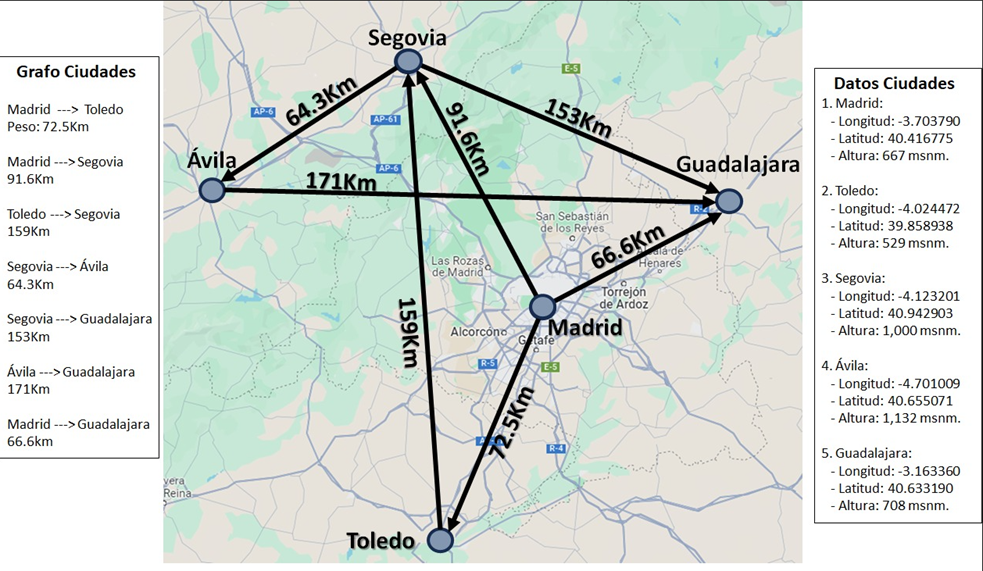
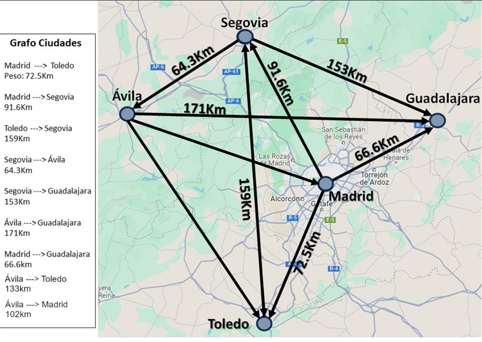

# Bus-Station
A simulation of an automatic bus company through the data structure Graphs, developed with Python and POO

There is two maps of a city. The first  with 4 stations, and the second with 5 .

With this program we are looking forward to solve two problems:

1. With the first map we are going to give all the routes from Madrid which is the star station to Guadalajara
which is the arrival station, each routes with its costs.

2. With the second map:

There are 5 stations in a city, each stations is a Node, and they are all connected in a specific direction as it is 
shown in the second image. And there is a Bus object which is going to pick up the passengers of each station in ascending 
order starting with the station which has the least number of passengers and finishing with the one with most of them.
The start station will always be Madrid and the arrival station is going to be Guadalajara.

The bus has a max capacity of 15 passengers if the bus filled its capacity during the trip, it will find the way to 
Guadalajara which is the arrival station. If there is still at least 1 passenger in all the city when a trip has finished
it will be an algorithm to create a Random number of passenger and distribute them through all the stations.

The system will finish when there is no passengers in the city.

